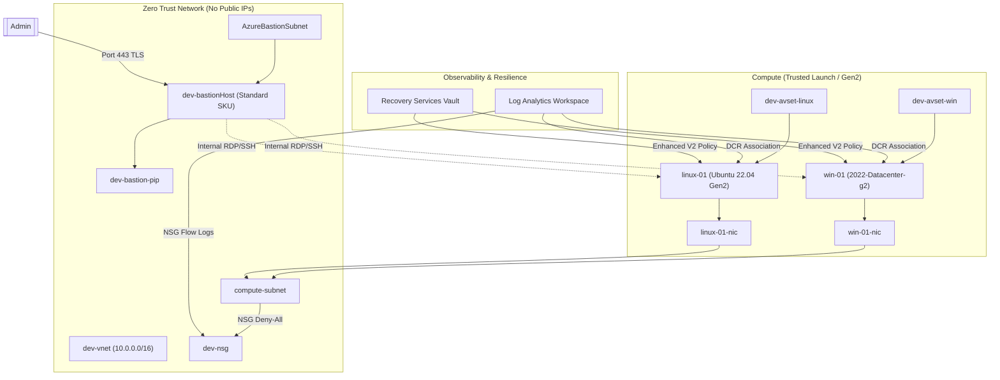

Congratulations! Getting that `"status": "Succeeded"` after navigating Gen2 images, Enhanced V2 backup policies, and Bicep compiler edge cases is a massive achievement. You didn't just write a script; you wrestled with the Azure ARM engine and won.

Here is a highly professional, portfolio-ready `README.md` that highlights the advanced architecture, the real-world problems it solves, and the deep Azure knowledge required to build it.

Save this as `README.md` in your repository:

---

````markdown
# 🛡️ Azure Enterprise Secure VM Factory

A battle-tested, production-grade Azure Bicep template for deploying highly secure, resilient, and observable Virtual Machines.

This project shifts away from imperative CLI scripts to declarative Infrastructure as Code (IaC). By passing a simple array of configurations, this single file dynamically provisions a complete Zero-Trust environment—including network isolation, OS-specific hardening, and automated backup—handling several undocumented Azure API quirks along the way.


---

## 🎯 The Problem & The Solution

**The Problem:** Deploying VMs in Azure is easy; deploying them _securely and consistently_ is incredibly difficult. Teams often fall into the "Snowflake" trap: opening port 3389 to the internet, forgetting to enable backups, mixing OS patching schedules in the same Availability Set, and writing copy-paste scripts that fail on API edge cases.

**The Solution:** This template enforces an enterprise baseline by default. You define _what_ you want (e.g., one Windows VM, one Linux VM), and the template handles the _how_.

### How it solves enterprise problems:

- **Solves Security:** Enforces a Zero-Trust network. No public IPs are ever created. Access is strictly restricted to an internal Azure Bastion host over TLS.
- **Solves Consistency:** A single array loop dynamically evaluates the OS type, swapping Windows/Linux image references, disk SKUs, and extension publishers automatically.
- **Solves Resilience:** Segregates Windows and Linux VMs into separate Availability Sets to prevent correlated update-domain reboots.
- **Solves Compliance:** Automatically enables Trusted Launch (Secure Boot / vTPM) and registers VMs with Enhanced V2 Backup policies.
- **Solves API Quirks:** Contains specific architectural workarounds for known Azure ARM engine bugs (e.g., `resourceId()` dependency bypasses, Gen2/Gen1 backup container formatting).

---

## 🏗️ Architecture


````

---

## ⚙️ Key Enterprise Features

- **Dynamic Multi-OS Looping:** Uses Bicep ternary logic to deploy mixed OS workloads from a single block of code, dynamically handling OS profiles and extension publishers.
- **Trusted Launch Enabled:** Forces Generation 2 VMs utilizing `2022-Datacenter-g2` and `22_04-lts-gen2` SKUs to enable Secure Boot and vTPM.
- **Enhanced V2 Backup:** Implements the newly required `policyType: 'V2'` for Recovery Services, which is strictly enforced for Gen2/Trusted Launch VMs.
- **Mathematical Subnetting:** Uses Bicep's native `cidrSubnet()` function to dynamically calculate non-overlapping compute and Bastion subnets based on any input VNet range.
- **OS-Isolated Availability Sets:** Routes Windows and Linux VMs into separate `Aligned` sets, ensuring a Windows patch Tuesday doesn't accidentally take down Linux web servers.
- **Extension Race Conditioning:** Enforces explicit `dependsOn` chains to prevent Custom Scripts from executing before the Azure Monitor Agent has fully registered.

---

## 🚀 Quick Start

### Prerequisites

1. [Azure CLI](https://learn.microsoft.com/en-us/cli/azure/install-azure-cli) installed and logged in (`az login`).
2. An existing Resource Group.
3. An existing Log Analytics Workspace.

### Deployment

Because of the complex parameters (like SSH keys), this template prompts for inputs interactively via the Azure CLI:

```bash
az deployment group create \
  --resource-group <myResourceGroup> \
  --template-file main.bicep
```

Follow the terminal prompts to enter your Admin Username, Password, Log Analytics Workspace ID, etc.

---

## 📋 Parameter Guide

| Parameter                 | Required | Description                                                                  |
| :------------------------ | :------- | :--------------------------------------------------------------------------- |
| `prefix`                  | Yes      | Prefix for network/bastion resources (e.g., `dev` creates `dev-vnet`).       |
| `VmConfigs`               | Yes      | Array of VM objects. Mix Windows/Linux by changing the `osType` field.       |
| `logAnalyticsWorkspaceId` | Yes      | Resource ID of the workspace to receive NSG flow logs and VM telemetry.      |
| `dataCollectionRuleId`    | No       | If provided, VMs bind to this DCR. If empty, AMA installs but remains inert. |
| `createNewNetwork`        | No       | Set to `false` to drop VMs into an existing subnet via `existingSubnetId`.   |
| `autoShutDownTime`        | No       | 24hr UTC time (e.g., `1900`) to automatically power down VMs to save costs.  |

---

## 🧠 Under the Hood: Overcoming Azure Quirks

Building this template required digging into Azure REST API documentation to bypass several strict engine validations. This section exists to help other engineers who hit these same walls.

1. **The Subnet Dependency Bypass:** Bicep normally builds dependency graphs via symbolic references. However, to allow toggling between new/existing networks, we used the `resourceId()` string function. This made Bicep "blind" to the subnet, causing NIC deployment race conditions. We solved this by explicitly declaring `dependsOn: createNewNetwork ? [ computeSubnet ] : []` inside the loop.
2. **The Gen2 Backup Formatting:** Azure Backup strictly requires `IaasVMContainer;iaasvmcontainerv2` (with a capital `I` and `C`) for Gen2 VMs. Using lowercase or omitting the prefix results in silent `Container name is not in the correct format` failures.
3. **The V2 Policy Requirement:** Even if you specify Trusted Launch, Azure will block standard backup policies (`SimpleSchedulePolicy`). The policy _must_ be upgraded to `SimpleSchedulePolicyV2` with `policyType: 'V2'`.
4. **Bicep Output Compiler Limitations:** Due to a known limitation in Bicep where resource collection arrays cannot be safely mapped in output blocks (`The language expression property 'id' doesn't exist`), the `vmResourceIds` output is commented out in favor of relying on Azure Portal deployment logs.

---

## 🔐 Post-Deployment: How to Connect

Because these VMs have no public IPs, you access them securely via the Bastion host:

1. Go to the Azure Portal -> your Resource Group.
2. Click on `dev-bastionHost`.
3. At the top, click **Connect** -> select `win-01` or `linux-01`.
4. Choose **Bastion** (for browser-based) or **Native Client** (for local RDP/SSH client).
5. Enter the `adminUsername` and `adminPassword` you provided during deployment.


